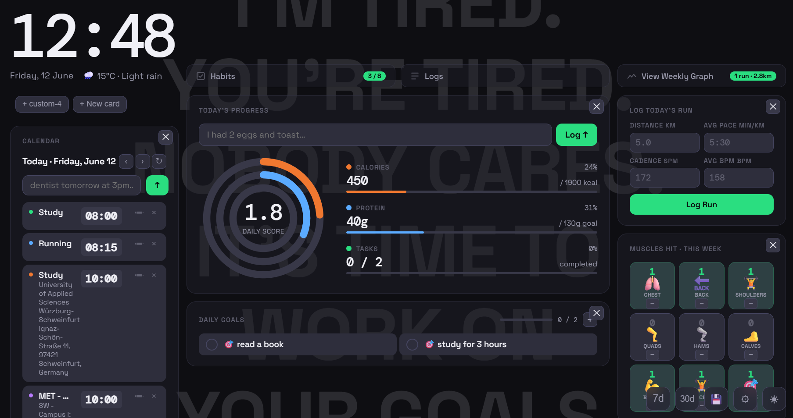
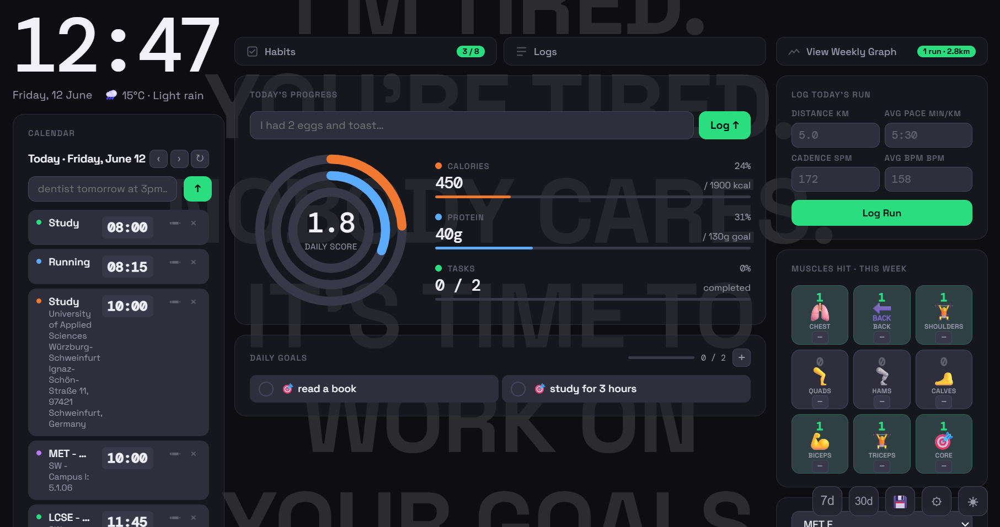

# Personal Dashboard

A self-hosted web app I built to track my daily life in one place — meals, workouts, runs, habits, goals, and calendar — with lightweight AI integration so I can log things in plain English instead of filling out forms.

Built as my first real web project using [Claude Code](https://claude.ai/code), with little to no prior web development experience.


## What it does

### Activity Rings
Three rings visible at the top of every view — calories consumed vs goal, protein intake vs goal, and daily task completion. Updates in real time via WebSocket.

### AI Meal Logging
Type something like *"2 scrambled eggs and a slice of toast"* and Groq's LLaMA model parses it into structured macros (calories, protein, carbs, fat) and logs it automatically. Manual entry with full macro breakdown is also available.

### AI Calendar Access
Natural language calendar control — type *"dentist appointment tomorrow at 3pm"* or *"move my 9am meeting to 11"* and it creates, updates, or deletes the Google Calendar event. Existing events for the day are passed as context so the model knows what's already there.

### Google Calendar Integration
Reads and writes directly to Google Calendar. Supports create, update, and delete — both manually via edit/delete buttons on each event and through the AI bar.

### Workout Tracker
Weekly muscle-group grid. Tap + to log a set for a muscle group; the chip lights up when hit. Tracks Chest, Back, Shoulders, Quads, Hamstrings, Calves, Biceps, Triceps, and Core. Resets every Monday.

### Habit Tracker
Weekly check-in grid for custom habits. Tracks streaks and shows the last 7 days at a glance.

### Daily Goals
Personal to-do style goals for the day. Tap to mark done; completion feeds into the task ring.

### Run Tracker
Log runs with distance, pace, cadence, and BPM. Weekly bar chart shows each day's distance. Last run stats shown below the log form.

### Study Log
Log study sessions by subject with hours and minutes. Shows a running total for the day.

### Weekly & Monthly Reports
One-click reports that summarise average calories, average protein, habit completion rate, weight change, and goal completion over the last 7 or 30 days.

### Google Drive Backup
Automatic nightly backup of the SQLite database to Google Drive. Manual trigger also available from the dashboard.

### General Purpose cards
User can create his own tracking cards eg- water or insulin. Value and units are to be entered and the user has the options of Bar graph, rings, or line graph visualizations along with a choice between logging frequency- weekly or daily 
---

## Tech stack

| Layer | What |
|-------|------|
| Backend | Node.js + Express |
| Database | SQLite via better-sqlite3 |
| Auth | Google OAuth 2.0 (optional) + auto-login for single-user personal use |
| AI | Groq API — `llama-3.3-70b-versatile` |
| Calendar | Google Calendar API |
| Backup | Google Drive API |
| Real-time | WebSocket (`ws`) |
| Frontend | Vanilla HTML / CSS / JS — no framework |
| Sessions | express-session + connect-sqlite3 |

---

## Security

- IP whitelist — only devices on the allowlist can reach the server
- Session cookies are `httpOnly`, `secure` in production, 30-day expiry
- All secrets live in `.env`, never committed

---

## Mobile

A separate mobile-optimised view is served automatically to phones based on user-agent. Same features, bottom-tab navigation, bottom-sheet modals, touch-friendly controls. Also accessible at `/mobile` to force the mobile view on any device.

---

## Running locally

```bash
# Install dependencies
npm install

# Create your .env (copy the example and fill in your keys)
cp .env.example .env

# Start the server
node --env-file=.env server/index.js
```

Open `http://localhost:3001` in your browser.

---

## Notes

Personal-use project. Next goal- multi-user support. Currently Runs on a home server behind a Cloudflare Tunnel and is accessible only from my own devices.




---
